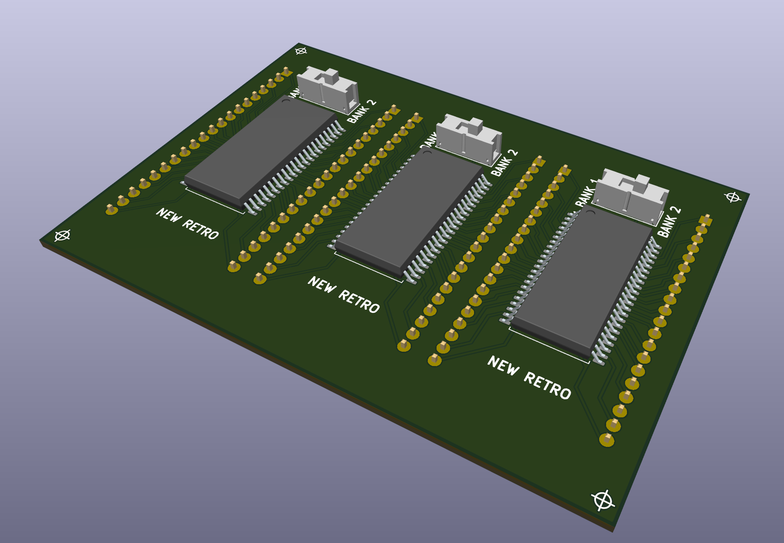

# SOP-44 to DIP-40 EEPROM Adapter

This project is designed to allow SOP-44 EEPROM IC's to be used in DIP-40 ROM applications. This was created specifically with 8 MBIT EEPROM chips being used with the Sega Saturn game console, though should work fine with other hardware that uses a DIP-40 DIP footprint. There is a ROM bank selector that allows the end user to choose which 4 MBIT ROM they wish to use via a SPDT switch, allowing for two BIOS ROM's to be utilized from a single chip.

